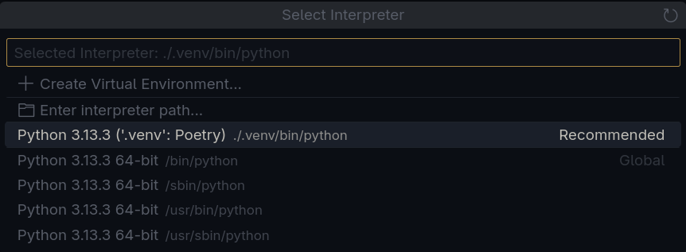

# econnect-api

[](https://www.python.org/downloads/)
[](https://python-poetry.org/)

API REST para o projeto Econnect, desenvolvido em Python com o framework FastAPI.

## Funcionalidades

- Scrapping de notícias sustentáveis
- Acrescentar mais futuramente

## Pré-requisitos

- Python **3.13** ou superior instalado no sistema

## Passo a passo para configurar o ambiente

### 1. Instalar o Poetry

```bash
curl -sSL https://install.python-poetry.org | python3 -
```

### 2. Clonar o repositório

```bash
git clone https://github.com/Gabzk/econnect-api.git
cd econnect-api
```

### 3. Configurar o Poetry para criar o ambiente virtual dentro do projeto e instalar as dependências

```bash
poetry config virtualenvs.in-project true
poetry install
```

### 4. Configurar as variáveis de ambiente

Crie um arquivo `.env` na raiz do projeto e adicione as variáveis de ambiente necessárias. Exemplo:

```env
user=user_exemplo
password=password_exemplo
host=host_exemplo
port=port_exemplo
dbname=dbname_exemplo
```

### 5. Configurar a IDE para usar o interpretador do ambiente virtual

Aponte o interpretador Python da sua IDE (VSCode, PyCharm, etc.) para:

Exemplo para o VSCode:


`./.venv/bin/python` (Linux/Mac)
`./.venv/Scripts/python.exe` (Windows)

Isso permitirá que:

- A IDE detecte automaticamente as bibliotecas instaladas
- Autocomplete e linting funcionem corretamente
- Você execute o código diretamente sem precisar ativar o ambiente com poetry shell

### Dúvidas comuns

#### O que é o *Poetry*

Poetry é um gerenciador de dependências e ambientes virtuais para projetos Python. Ele facilita o controle de versões, instalação de pacotes e empacotamento do projeto

#### O que é o *Poetry Shell*

Poetry shell é um comando para seu terminal usar o venv(variaveis de ambiente do projeto) para executar os comandos python

Colocando o .venv diretamente no projeto e definindo como interpretador padrão na sua IDE você não precisa usar o poetry shell e sua IDE vai conseguir reconhecer perfeitamente o projeto

### Licença

Este projeto é licenciado sob a Licença MIT
